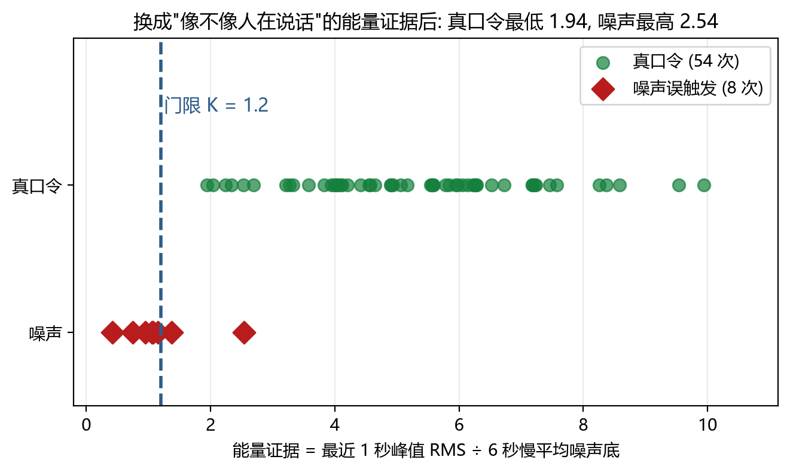

# 离线语音控制小车：从"听得准"到"不会闯祸"

> **Offline Voice-Controlled Robot Car — a reproducible evaluation harness and a four-layer safety design for on-device speech commands.**
>
> 面向"无网/弱网、免手操作、安全攸关"场景（医院病房、养老院、仓库）的离线中文语音控制方案。
> 本项目**不训练语音模型**，它解决的是另一个同样关键、却常被忽略的问题：
> **当本地小模型听错、听漏、没听清的时候，系统如何保证安全。**

[]()
[]()
[]()
[]()

---

## 这个项目解决了什么问题

离线语音控制常被简化成"把云端语音换成端侧模型"。但真正用过就会发现，三个问题依次冒出来：

| 问题 | 常规做法 | 我们做了什么 |
|---|---|---|
| **测不准**：换个房间、换个人、换个音量，结论就变 | 人工喊几遍，报个大概的成功率 | 建**可复现评测台**：统一音频测试轨 + 串口时钟对齐，把"感觉"变成可测量的数据 |
| **分不清**：模型会对着噪声报出一条命令 | 调高置信度阈值，结果真口令也被挡掉 | 用实测数据证明**后验概率分不开真口令与噪声**，改用**音频能量证据**做判决 |
| **停不下来 / 乱动**：听错方向、噪声误触发 | 靠调参和运气 | **四层安全体系**：意图层 → 现实层 → 执行层 → 兜底层 |

**一句话概括**：别人在做"能干的机器人"，我们在做"**不会闯祸的机器人**"。

---

## 核心数据（全部来自本仓库 `data/` 中的实测记录，可复现）

| 指标 | 结果 | 说明 |
|---|---|---|
| 命令词召回率 | **92.9% → 100%** | 把触发门限降到 0.05 当"召回层" |
| 噪声误触发 | **挡掉 86%+** | "精度层"用音频能量证据判决 |
| 全链路响应延迟 | **约 0.45 秒** | 完全离线，无网络往返 |
| 语音模型体积 | **2.83 MB** | 可运行于 16MB Flash 的设备（三代模型对比后择优，比上一代小 26%）|
| 驱动成功率 | **36% → 100%** | 容错设计：总线降速 + 指令心跳 + 驱动看门狗 |
| 定角度转向精度 | **残差 ≤ 3°** | 惯性测量单元闭环 + 停车后惯性滑转修正 |

---

## 判决算法的来龙去脉（这是本项目最想分享的部分）

### 第一步：最直觉的方案，被数据否定了

想法很自然——用模型输出的**后验概率 + 边际（top1−top2）**做拒识：概率低就拒识，分不清就拒识。

实测结果（见 `docs/01-experiments.md`）：

| 观察 | 数值 |
|---|---|
| 真口令的 top-1 后验 | 平均 0.178，**最低 0.051** |
| 噪声凭空触发的后验 | 平均 0.081，**最高 0.141** |
| 边际特征 | 所有检测 `num=1`，**根本不存在亚军** |

**真口令的最低值比噪声的最高值还低，两者完全重叠。** 后验概率这条路走不通。

### 第二步：换成模型之外的物理量

既然模型的输出分不开，就引入硬件信号链里的信息：**检测发生的那一刻，麦克风到底有没有收到"人在说话"的能量。**

```
能量证据 = 最近 1 秒峰值 RMS ÷ 6 秒慢平均噪声底
```

真口令 ≥ 1.94，噪声 ≤ 2.54，**沿一条轴分开了**。按"误动代价 3 倍于漏检"的代价函数选门限 K=1.2：



### 第三步：组合成两层判决

```
全局触发门限 0.05     ← 召回层：把该报的都报出来（召回 92.9% → 100%）
        ↓
设备端判决规则         ← 精度层：
   score[i] = prob[i] + bias[命令]      （后验偏置，本项目数据下 bias 全为 0）
   接受需同时满足：
     score_max >= tau[命令]
     score_max - score_2nd >= margin
     ratio >= 1.2                       （能量门，挡掉噪声误触发）
   否则拒识：屏幕提示"没听清"，不动电机
```

代价：每 32ms 一次乘加（512 点 RMS），**零额外内存、不增加识别延迟**。

---

## 四层安全体系

| 层 | 目标 | 手段 | 实测 |
|---|---|---|---|
| **意图层** | 听得准 | 三代模型横向评测 + 双层判决 | 召回 100% |
| **意图层（应急）** | 说得停 | 急停 5 个同义词、不受任何门禁、可中止正在执行的转向 | 行驶 36 秒后仍一次生效 |
| **现实层** | 不撞人 | 超声波三级策略：70cm 减速 → 18cm 停车 → 有障碍拒绝"前进" | 伸手挡车头立即停车 |
| **执行层** | 动作真落地 | 速度指令 200ms 心跳重发 + "有目标却不动"就重建驱动板 | 成功率 36% → 100% |
| **兜底层** | 完全失控 | 长时自动停机 | — |

**设计原则：新增的安全通道必须复用同一条"停车路径"。**
我们踩过这个坑：转向跑在独立任务里，"停下"如果只调 `motor_stop()`，转向循环下一轮就会把速度覆盖回去——表现为"喊停没反应"。所以超声波急停和语音急停共用 `heading_abort_turn() + motor_stop()`。

---

## 快速开始

### 0. 你需要什么

- ESP32-S3 开发板 + 小车底盘（本项目在幻尔 ESP32-S3 小车上验证，板载麦克风、扬声器、LCD、IMU、XL9555 扩展 IO、电机驱动板）
- 车头超声波模块（I²C 0x77，用于物理急停）
- ESP-IDF v5.4 + ESP-SR
- Python 3.10+（`pyserial`、`matplotlib`）
- Windows（评测台用 `winsound` 回放音频；移植到 Linux 请改用 `aplay`/`paplay`）

### 1. 复现评测实验（**不需要硬件就能看懂结论**）

```bash
cd bench
python gen_voice.ps1                 # 用 Windows TTS 生成 8 条固定口令 WAV
python normalize_voice.py            # 归一化到同一峰值，保证各口令音量一致
python make_track.py std8 8 7 block  # 拼成一条长测试轨（含精确时间点 JSON）
python bench_tts.py --tag mn7 --track std8 --port COM3   # 回放 + 串口打点 + 出报告
python analyze_rules.py --tag mn7 --track std8 --write   # 后验/能量分析 + 门限扫描
python make_figures.py               # 生成本 README 里的所有图表
```

报告与原始数据会写到 `bench/bench_<tag>.txt / .csv / _serial.log`。

### 2. 把固件改动应用到小智固件的工程里

`firmware/main/` 下是**我们修改或新增的文件**，请覆盖到 [xiaozhi-esp32](https://github.com/78/xiaozhi-esp32) 工程的对应路径，并按你的硬件改 `config.h` 里的引脚定义。

关键改动文件：

| 文件 | 作用 |
|---|---|
| `audio/wake_words/custom_wake_word.cc` | **判决规则层**：唤醒门、能量门、安全仲裁、灯语反馈 |
| `boards/HiwonderExploit_S3/motor.c/h` | 电机控制 + 速度指令心跳 + 驱动看门狗 + 运动核对 |
| `boards/HiwonderExploit_S3/heading.c/h` | 惯性测量单元航向闭环与定角度转向 |
| `boards/HiwonderExploit_S3/obstacle.c/h` | 超声波三级避障与物理急停 |
| `boards/HiwonderExploit_S3/feedback.cc/h` | 场景反馈（灯语 + 电量告警）|
| `application.cc` / `boards/common/wifi_board.cc` | 完全离线模式（连不上网也照常工作）|

配置项在 `Kconfig.projbuild` 里，可用 `bench/set_cfg.py` 安全地改（见下方"踩坑"）。

---

## 仓库结构

```
offline-voice-control-car/
├── firmware/main/          我们修改/新增的固件文件（其余属于上游 xiaozhi-esp32）
├── bench/                  可复现评测台（本项目的核心工具）
│   ├── bench_tts.py        单轨回放 + 串口打点 + 时钟对齐 + 出报告
│   ├── make_track.py       生成音频测试轨（block/flow/wake 三种布局）
│   ├── analyze_rules.py    后验/能量分析 + 门限扫描 + 2 折交叉验证
│   ├── capture.py          串口日志抓取（带自动重连）
│   └── set_cfg.py          安全修改 sdkconfig
├── tools/                  辅助脚本（图表、Logo 生成）
├── docs/                   实验记录与调试记录
│   ├── 01-experiments.md          算法实验记录（模型对比 + 判决算法）
│   ├── 02-hardware-debugging.md   硬件调试记录（证据链完整）
│   └── 03-functionality-and-scenarios.md  按场景梳理的功能模块
├── data/                   原始实验数据（可复现的凭据）
│   ├── bench_*.csv / *.txt
│   └── logs/*.log          串口日志（已过滤为只保留本项目相关行）
└── assets/                 图表与 Logo
```

---

## 我们踩过的坑（写给后来者，能省你几天）

这些坑都写进了 `docs/02-hardware-debugging.md`，每条都有日志证据：

| 坑 | 真相 |
|---|---|
| **"日志显示指令下发成功，车却不动"** | 原日志打在 I²C 写入**之前**，且不检查返回值——它什么都没证明。所有动作日志必须打在动作之后并带执行结果 |
| **驱动时好时坏，14 次只有 5 次成功** | I²C 在 400kHz 下该链路不可靠（读回乱码、指令失效）。降到 100kHz 后全部成功 |
| **"说左转 90 度，实际转了 150 度"** | 闭环在惯性滑转**之前**就停车，日志记的是"停车瞬间"。差值 60 度就是停车后的滑转——**当测量值与观测值不符时，先怀疑"测量的是哪个时刻"** |
| **零偏自校正把自己锁死** | 用"扣掉零偏后的角速度 < 3dps"判断静止，零偏本身偏了 12dps 时就永远进不了该分支。静止判据必须用**原始值** |
| **避障把转向也拦住了** | 规则写得太粗：原地转向不改变位置，不该被前方传感器约束。按运动类型区分即可 |
| **"拒绝启动的距离"必须大于"行驶中停车的距离"** | 否则两个规则互相打架，车会原地一抽一抽地抖 |
| **安全阈值不能"看起来够远"** | 第一版停车距离定 20cm，看着够；但 `刹车距离 = 检测延迟 × 速度 + 响应延迟 × 速度 + 惯性滑行 ≈ 25cm`，**必然撞**。改成"速度 25→15 + 70cm 起减速 + 18cm 停车"才停得住 |
| **PowerShell 改 sdkconfig 会搞挂编译** | Windows PowerShell 5.1 的 `Get-Content` 默认按 GBK 读，会把 UTF-8 中文读成乱码写回，esp-sr 的脚本一读就崩。一律用 Python 改（`bench/set_cfg.py`）|

---

## 我们**没有**做什么（诚实说明）

- **没有训练语音模型**：命令词识别用的是乐鑫 ESP-SR 的预训练 MultiNet 模型（mn6/mn7），我们做的是**模型选型对比**与**判决算法**。
  如果你在找"如何训练自定义唤醒词"，请参考乐鑫的 ESP-SR 训练工具链。
- **没有做视觉与激光雷达**：本项目聚焦"离线语音控制的可靠性"，感知只用了一个超声波模块与板载惯性测量单元。
- **没有做完整的量产验证**：目前是实验室环境下的验证样机，尚未进入中试与认证阶段。项目阶段与产品化路径见 `docs/03-functionality-and-scenarios.md`。

---

## 许可证与致谢

本项目**仅包含我们修改或新增的代码**，其他部分来自下列开源/商业项目，版权归各自所有者：

| 来源 | 说明 |
|---|---|
| [xiaozhi-esp32](https://github.com/78/xiaozhi-esp32) | 板级适配层与应用框架的基础（MIT）|
| [ESP-SR](https://github.com/espressif/esp-sr)（乐鑫） | 离线语音识别（MultiNet）与模型 |
| 幻尔科技（Hiwonder） | 小车硬件与部分外设驱动示例（`motor.c/h`、`qmi8658.c/h`、`ultrasound.c/h`、`xl9555.c/h` 源自其官方例程，我们做了修改，已在文件头注明）|

**特别说明**：`firmware/main/boards/HiwonderExploit_S3/` 下的外设驱动由厂商例程改写而来，请在使用与再分发前确认其授权条件。若你只想复现算法部分，`bench/` 与 `docs/` 是完全独立的，不依赖厂商代码。

本仓库中我们自己编写的部分采用 MIT 许可证，详见 [LICENSE](LICENSE)。

---

## 引用

如果这份工作对你的研究或项目有帮助，欢迎引用：

```bibtex
@misc{offline_voice_control_car,
  title  = {Offline Voice-Controlled Robot Car: A Reproducible Evaluation Harness and a Four-Layer Safety Design for On-Device Speech Commands},
  year   = {2026},
  note   = {https://github.com/<your-name>/offline-voice-control-car}
}
```
